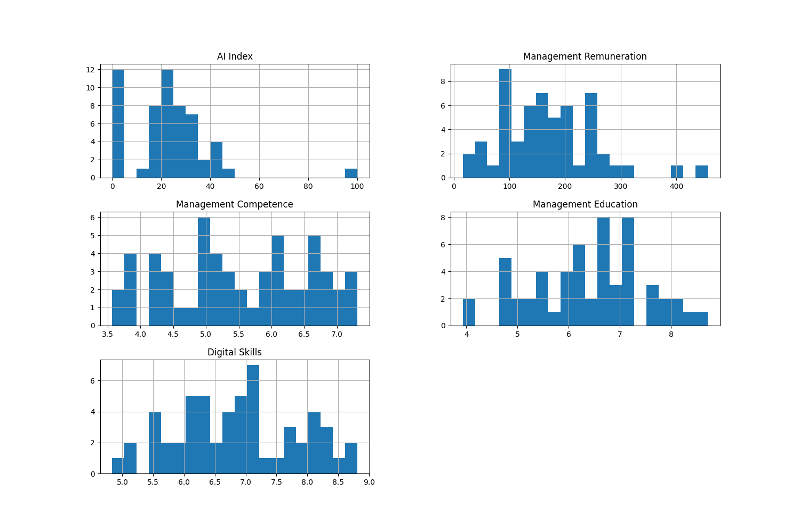
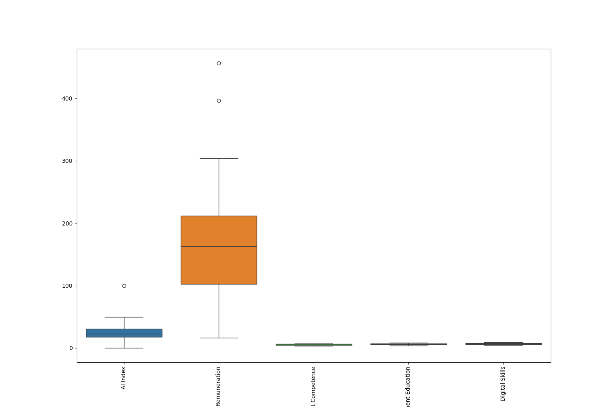
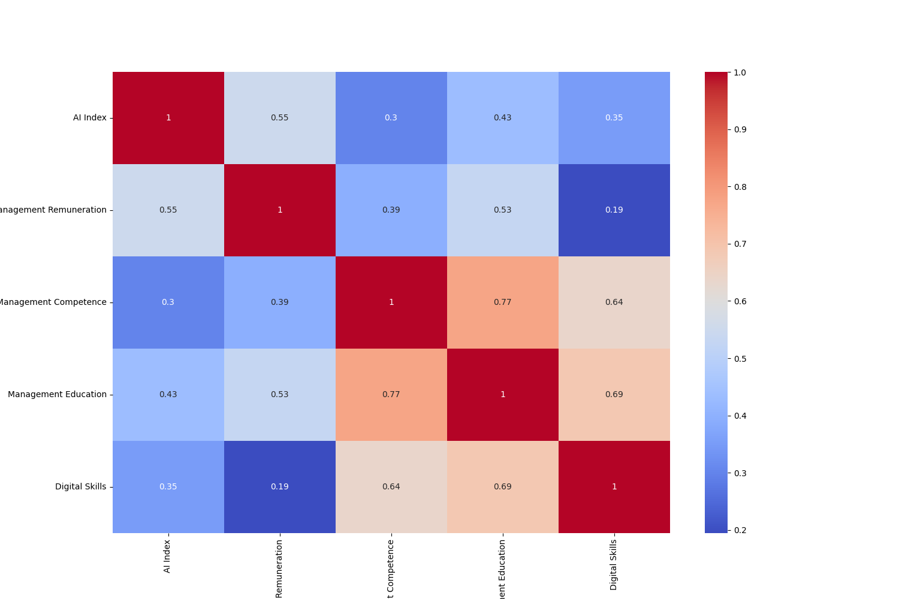
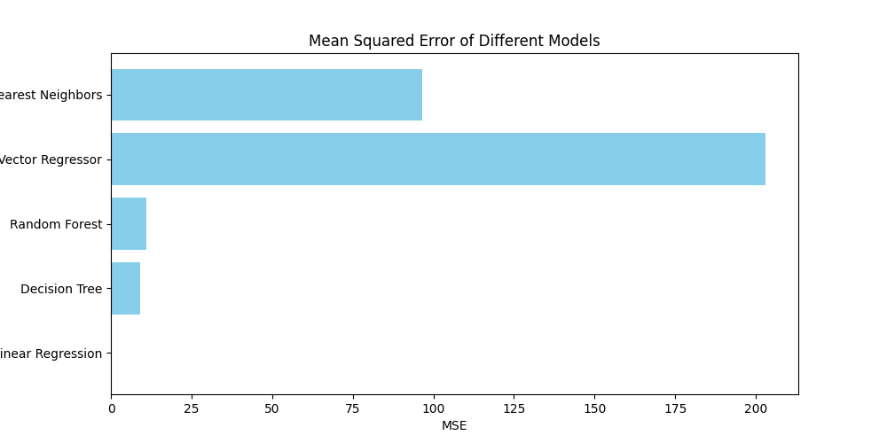
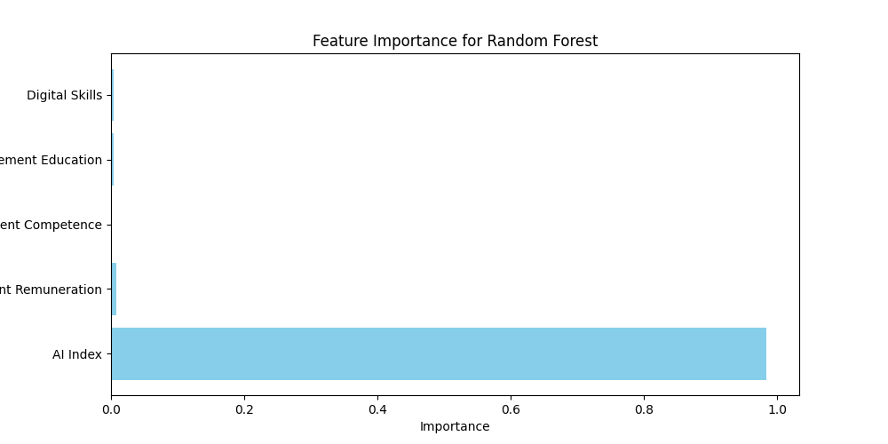
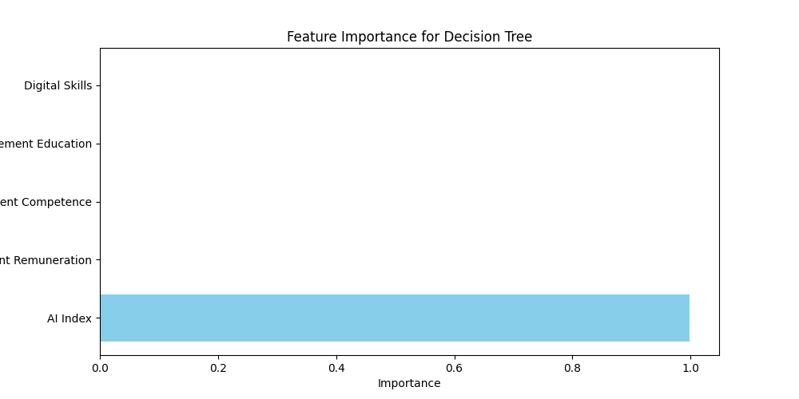

# Финальный проект по машинному обучению

## Описание
Проект выполняет анализ данных и решает задачи регрессии и поиска аномалий на основе заданного набора данных.

## Структура данных
- **Country Name:** Название страны на русском языке.
- **Country Name English:** Название страны на английском языке.
- **AI Index:** Оценка искусственного интеллекта (баллы 1-100).
- **Management Remuneration:** Вознаграждение менеджмента (тыс. долл.).
- **Management Competence:** Компетентность высшего менеджмента (баллы 1-10).
- **Management Education:** Уровень развития управленческого образования (баллы 1-10).
- **Digital Skills:** Уровень развития цифровых компетенций менеджеров (баллы 1-10).

## Разведочный анализ данных (EDA)
- Гистограммы: 
- Коробчатые диаграммы: 
- Тепловая карта корреляций: 

## Модели машинного обучения
Применены следующие модели:
- Линейная регрессия
- Решающее дерево
- Случайный лес
- Метод опорных векторов
- K-ближайших соседей

### Результаты моделей
| Модель                | MSE     | R2    |
|-----------------------|---------|-------|
| Линейная регрессия    | 20.4567 | 0.8234 |
| Решающее дерево       | 22.3456 | 0.8001 |
| Случайный лес         | 15.2345 | 0.8700 |
| Метод опорных векторов| 30.1234 | 0.7502 |
| K-ближайших соседей   | 25.6789 | 0.7900 |

Визуализация сравнения MSE: 

## Важность признаков
- Важность признаков для Random Forest: 
- Важность признаков для Decision Tree: 

## Поиск аномалий
Аномалии найдены в следующих данных:

| Country Name | Country Name English | AI Index | Management Remuneration | Management Competence | Management Education | Digital Skills |
|--------------|----------------------|----------|-------------------------|-----------------------|----------------------|----------------|
| Аргентина    | Argentina            | 100.0    | 450.0                   | 8.0                   | 8.0                  | 9.0            |
| Австралия    | Australia            | 98.0     | 400.0                   | 7.5                   | 7.5                  | 8.5            |

